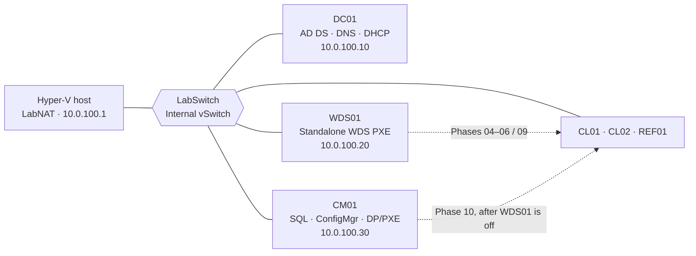

# ad-pxe-lab

A resume-grade Hyper-V home lab for administering Active Directory, delivering Windows through
PXE, and operating a small Configuration Manager site. It is deliberately built in two layers:
PowerShell creates the isolated host and base operating systems; the runbooks then use the
management consoles (with PowerShell equivalents) for AD DS, GPO, WDS, and Configuration Manager.

The lab is sized for a host with roughly 32 GB available to virtual machines, while keeping at
least 4 GB for the host. It uses the isolated `LabSwitch` subnet `10.0.100.0/24`, the
`hufflab.internal` forest, and separate DC01, WDS01, and CM01 roles. The important operational
rule is that a subnet has exactly one PXE responder: WDS01 first, then CM01 only after WDS01 is
disabled and powered off.

## Architecture

See the full [architecture](docs/architecture.md), [IP plan](docs/ip-plan.md), and the rationale
behind each major choice in the [architecture decisions](docs/decisions.md).

## What this demonstrates

1. **AD administration:** a domain controller with DNS and DHCP, an intentional OU and AGDLP
   design, users and groups, and workstation/user policy.
2. **PXE imaging:** standalone WDS deployment to CL02, a sysprepped Win11 reference image, and a
   captured `HUFFLAB-Win11-Golden.wim` deployed to CL01.
3. **Configuration Manager operations:** a Current Branch 2509 evaluation site with application
   deployment, software updates, a compliance baseline, reporting, and an OSD task sequence.

## Quickstart

1. Read [conventions](runbooks/00-conventions.md), then obtain and record the required media in
   the [ISO checklist](docs/iso-checklist.md).
2. On the Hyper-V host, run the readiness check and complete [Phase 01](runbooks/01-host-prep.md).
   Scripts create only the foundation and base OS; they do not configure product roles.
3. Work through Phases 02–10 in order, taking the named Hyper-V checkpoint before each phase and
   recording results in the [lab notebook](docs/lab-notebook.md).
4. Keep WDS01 as the sole PXE responder through the WDS and golden-image work. In Phase 10, first
   disable and power it off, prove PXE times out, and only then enable CM01 PXE.
5. Repeat the [AD operations drills](runbooks/drills-ad-ops.md) and retain screenshots, command
   output, and troubleshooting notes as evidence.

> **Credential note:** the runbooks use `LabP@ss2026!` only as an example. Replace it with your
> own strong lab password; scripts prompt for secrets and do not hardcode it.

## Phases and resume evidence

| Phase | Runbook | Resume bullet | Outcome to retain |
|---:|---|---|---|
| 00 | [Conventions](runbooks/00-conventions.md) | — | Naming, credential, checkpoint, and evidence discipline |
| 01 | [Host prep & lab foundation](runbooks/01-host-prep.md) | Infrastructure | Host readiness, `LabSwitch`, and `LabNAT` |
| 02 | [DC01: AD DS, DNS, DHCP](runbooks/02-dc01-adds-dns-dhcp.md) | #1 | Patched, authorized domain services and DHCP scope |
| 03 | [AD structure: OUs, users, groups, AGDLP](runbooks/03-ad-structure.md) | #1 | OU design and HR share AGDLP chain |
| 04 | [WDS standalone PXE → CL02](runbooks/04-wds-pxe-deploy.md) | #2 | Interactive WDS PXE deployment and domain-joined client |
| 05 | [GPO suite](runbooks/05-gpo-suite.md) | #1 | Workstation baseline and targeted drive map |
| 06 | [Golden image: REF01 → capture → CL01](runbooks/06-golden-image.md) | #2 | Captured and deployed golden WIM |
| 07 | [CM01 prerequisites](runbooks/07-cm01-prereqs.md) | #3 | Schema, SQL, ADK, WSUS, and delegation prerequisites |
| 08 | [SCCM site install & client onboarding](runbooks/08-sccm-site-install.md) | #3 | HUF site, discovery, boundary, collections, and client |
| 09 | [SCCM ops: apps, patching, compliance](runbooks/09-sccm-operations.md) | #3 | Application, update, and compliance evidence |
| 10 | [OSD & the WDS→ConfigMgr PXE handoff](runbooks/10-osd-pxe-handoff.md) | #2 + #3 | WDS-off negative test and ConfigMgr OSD deployment |
| Recurring | [AD operations drills](runbooks/drills-ad-ops.md) | #1 | Recoverability and AD health evidence |

## Design boundaries and survey summary

This design takes useful mechanics from MSLab (parent disks, NAT/private networking, declarative
settings), AutomatedLab (phase-oriented role decomposition), and established manual guides (a
proven DC01/CM01 separation). It intentionally avoids their weak points: it does not hide AD work
behind a framework, combine SCCM with a domain controller, or depend on MDT, which was retired in
October 2025. Standalone WDS is used only as a learning stage: modern WDS rejects Win11/Server
2025 media `boot.wim`, so this lab deliberately uses Server 2022 `boot.wim` before moving to
Configuration Manager OSD.

This is a learning lab, not a production blueprint. Evaluation media expires, SCCM is co-located
with SQL and WSUS on CM01 to fit the budget, and the same-subnet design needs neither DHCP options
60/66/67 nor IP helpers. The [decisions](docs/decisions.md) document those tradeoffs.

## Repository index

- **Docs:** [architecture](docs/architecture.md), [IP plan](docs/ip-plan.md),
  [decisions](docs/decisions.md), [ISO checklist](docs/iso-checklist.md), and
  [lab notebook](docs/lab-notebook.md).
- **Runbooks:** [conventions](runbooks/00-conventions.md), [Phases 01–03](runbooks/01-host-prep.md),
  [04](runbooks/04-wds-pxe-deploy.md), [05](runbooks/05-gpo-suite.md),
  [06](runbooks/06-golden-image.md), [07](runbooks/07-cm01-prereqs.md),
  [08](runbooks/08-sccm-site-install.md), [09](runbooks/09-sccm-operations.md),
  [10](runbooks/10-osd-pxe-handoff.md), and [recurring drills](runbooks/drills-ad-ops.md).
- **Automation:** [lab configuration](scripts/lab.config.psd1), [host readiness](scripts/00-Test-HostReadiness.ps1),
  [switch/NAT](scripts/01-New-LabSwitch.ps1), [parent disk](scripts/02-New-LabParentDisk.ps1),
  [VM creation](scripts/03-New-LabVM.ps1), [teardown](scripts/99-Remove-Lab.ps1), and the
  [server unattend template](scripts/unattend/unattend-server-base.xml).
