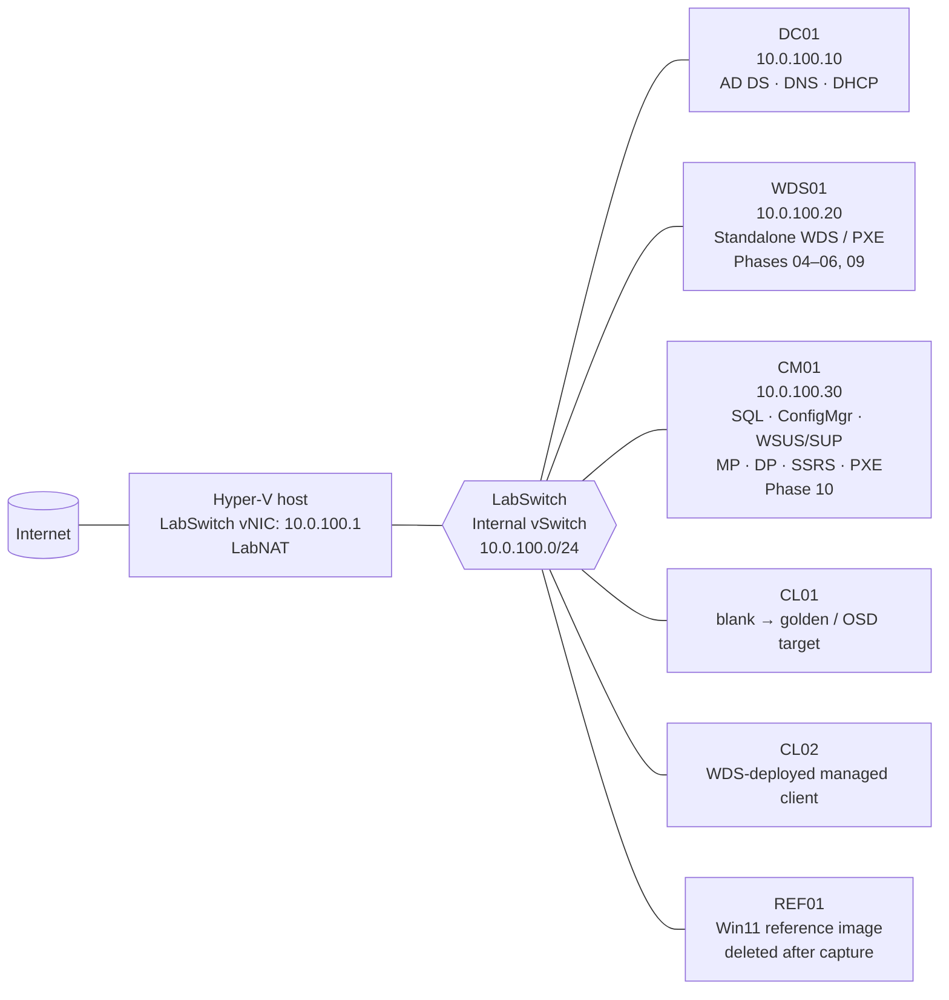

# Lab architecture

This lab demonstrates an AD DS administration workflow, a standalone WDS imaging workflow,
and a Configuration Manager operations workflow without combining conflicting PXE services.
It runs on a Hyper-V Internal switch and uses the host only for NAT; the lab remains isolated
from the physical LAN.

## Topology



DNS, DHCP, and AD DS intentionally stay together on DC01; SCCM and SQL intentionally stay
off the domain controller. WDS01 is the only PXE responder until the Phase 10 handoff. CM01
becomes the only responder after WDS01 is stopped, disabled, and powered off.

## VM sizing

All VMs are Generation 2 with UEFI and Secure Boot using the **Microsoft Windows** template.

| VM | OS | vCPU | RAM | Disk | Boot | Role |
|---|---|---:|---:|---|---|---|
| DC01 | Windows Server 2025 Eval | 2 | 4 GB static | 60 GB differencing | VHD | AD DS, DNS, DHCP |
| WDS01 | Windows Server 2025 Eval | 2 | 2 GB static | 60 GB differencing | VHD | Standalone WDS PXE; retired in Phase 10 |
| CM01 | Windows Server 2025 Eval | 4 | 16 GB static | 150 GB fixed VHDX | VHD | SQL 2022, ConfigMgr, WSUS/SUP, MP, DP, SSRS, PXE |
| CL01 | Blank | 2 | 4 GB dynamic | 60 GB dynamic | Network first | Golden-image, then SCCM OSD target |
| CL02 | Blank | 2 | 4 GB dynamic | 60 GB dynamic | Network first | WDS-deployed, domain-joined client |
| REF01 | Windows 11 Enterprise Eval | 2 | 4 GB dynamic | 60 GB dynamic | DVD | Golden-image reference; delete after capture |

`WS2025-parent.vhdx` is created once from the Server 2025 ISO, never booted, and used only
as the parent of the server differencing disks. CM01 is deliberately not a differencing disk:
SQL benefits from predictable I/O and the lab must preserve enough space for its content,
database, and WSUS files.

## Phase RAM budget

The VM budget is 28 GB, leaving at least 4 GB available to a 32 GB host.

| Phase | Active VMs | VM RAM | Budget result |
|---:|---|---:|---|
| 01 | None | 0 GB | Host preparation only |
| 02–03 | DC01 | 4 GB | 24 GB headroom |
| 04 | DC01, WDS01, CL02 | 10 GB | 18 GB headroom |
| 05 | DC01, CL02 | 8 GB | 20 GB headroom |
| 06 | DC01, WDS01, REF01, CL01 | 14 GB | 14 GB headroom |
| 07 | DC01, CM01 | 20 GB | 8 GB headroom |
| 08–09 | DC01, CM01, one client | 24 GB | 4 GB headroom |
| 10 | DC01, CM01, CL01; WDS01 off | 24 GB | 4 GB headroom |

## PXE handoff

The handoff is a controlled service transition, not a coexistence test. Microsoft documents
both WDS-backed and responder-without-WDS ConfigMgr PXE modes; this lab uses the latter on
CM01 only after retiring WDS01. See [ConfigMgr OSD infrastructure requirements](https://learn.microsoft.com/en-us/intune/configmgr/osd/plan-design/infrastructure-requirements-for-operating-system-deployment).

```mermaid
sequenceDiagram
  participant CL as CL01 / CL02
  participant DC as DC01 DHCP/DNS
  participant WDS as WDS01 WDS PXE
  participant CM as CM01 ConfigMgr PXE DP

  rect rgb(230, 242, 255)
    Note over CL,WDS: Phases 04–06 and 09: WDS01 is the sole PXE responder
    CL->>DC: DHCPDISCOVER / PXE broadcast
    DC-->>CL: Lease, gateway 10.0.100.1, DNS 10.0.100.10
    WDS-->>CL: PXE offer and Server 2022 WinPE boot image
    CL->>WDS: Select install or capture workflow
  end

  rect rgb(255, 241, 230)
    Note over WDS,CM: Phase 10: Stop WDSServer, disable it, then power off WDS01
    CL->>DC: DHCPDISCOVER / PXE broadcast
    DC-->>CL: Lease only; no PXE reply
    Note over CL: Negative test: network boot times out
    CM-->>CL: Enable ConfigMgr PXE responder without WDS
    CL->>CM: PXE boot to ConfigMgr WinPE
    CM-->>CL: Deploy Win11 Golden task sequence
  end
```

The standalone WDS phase uses a Server 2022 `boot.wim` for its WinPE experience and Windows
11 Enterprise evaluation media for its install image. Its capture output is
`HUFFLAB-Win11-Golden.wim`; ConfigMgr later applies that exact WIM through the OSD task
sequence. The ConfigMgr phase uses ADK 11 24H2 with its WinPE add-on. See [Windows deployment scenarios and tools](https://learn.microsoft.com/en-us/windows/deployment/windows-deployment-scenarios-and-tools)
for the deployment-tool roles and [PXE boot in Configuration Manager](https://learn.microsoft.com/en-us/troubleshoot/mem/configmgr/os-deployment/understand-pxe-boot)
for the PXE flow.
